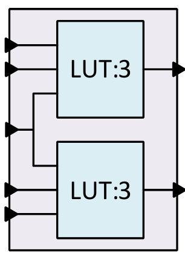
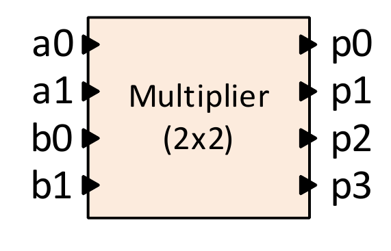

# AUT-RCS

## Reconfigurable Systems Assignment 01

### Problem 1
Determine the correctness or incorrectness of the following statements with good reason:

* **A.** It is not cost-effective to use FPGA compared to ASIC for mass production.

* **B.** Designs based on the general-purpose processor and the FPGA chip are two ends of the spectrum of efficiency and flexibility.

* **C.** Application specific integrated circuit chips (ASICs) are used to design the prototype and reach the market faster.

* **D.** Flash-based FPGA chips are the best choice in space applications and high-radiation environments.

* **E.** In a hierarchical routing architecture, interconnected logic blocks are placed close together to achieve less latency.

* **F.** Coarse-grained re-configurable systems have lower flexibility and less configuration time than fine-grained systems.

### Problem 2

* **A.** Compare the structure of Disjoint and Wilton switches and explain the advantages and disadvantages of each.

* **B.** Explain the HARP architecture and the capabilities it provides in FPGAs.

### Problem 3

Design the two-bit unsigned multiplier circuit in Figure 3 by using the minimum number of lookup table with a structure similar to Figure 1.

<figure>
  
  <figcaption>Fig. 1: Custom Lookup Table</figcaption>
</figure>

<figure>
  
  <figcaption>Fig. 2: Multiplier 2x2 </figcaption>
</figure>

